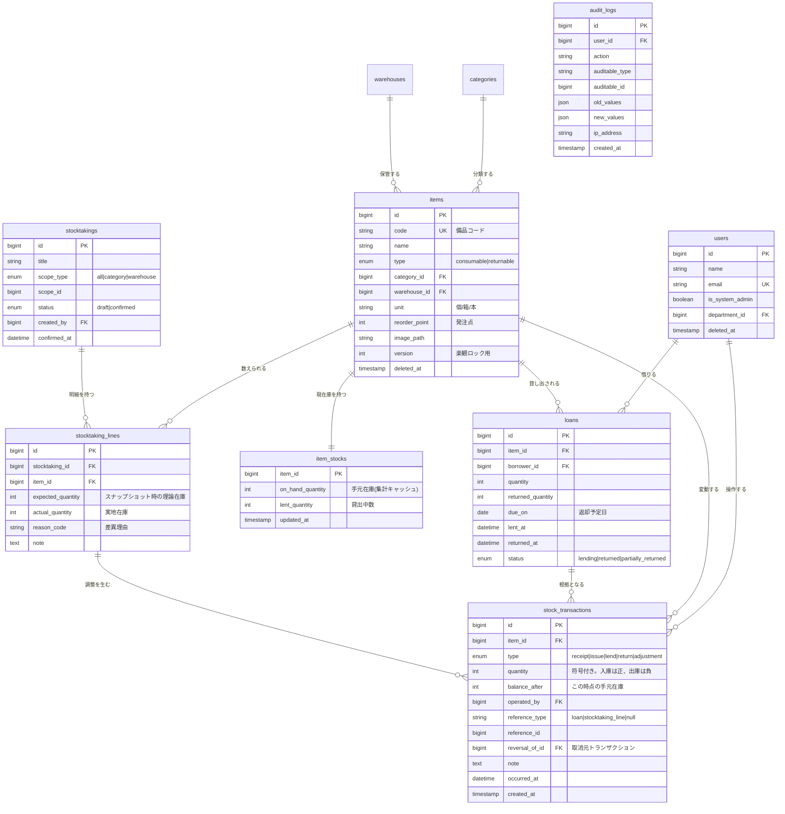

# 備品在庫管理システム 要件定義書

| 項目 | 内容 |
|---|---|
| ドキュメント名 | 備品在庫管理システム 要件定義書 |
| バージョン | 2.0 |
| 作成日 | 2026-09-03（最終更新 2026-09-06） |
| ステータス | 確定（§12 決定事項）|
| 関連文書 | `docs/architecture.md` / `docs/common/requirements.md` |

本システムは office-hub 上のシステムの1つであり、**ポータル画面から遷移して利用する**。認証・ユーザー管理・部署マスタ・システム利用権限は共通基盤が提供するため、本書では扱わない（`docs/common/requirements.md`）。

---

## 1. 背景と目的

### 1.1 現状の課題（想定する導入先：従業員 50〜200 名規模の企業の総務部門）

多くの企業で社内備品は Excel と口頭で管理されており、次の問題が起きている。

1. **現在庫が分からない** — 台帳の更新が後回しになり、使い切って初めて欠品に気づく
2. **持ち出しの記録が残らない** — ノート PC やプロジェクタが「誰かが借りたまま」行方不明になる
3. **発注タイミングが属人的** — 担当者の勘に依存し、担当者不在時に発注が止まる
4. **棚卸しの差異原因が追えない** — 帳簿と実物が合わないが、いつズレたのか分からない

### 1.2 目的

- 在庫の **「現在の数」と「そうなった経緯」** を、関係者全員が同じ画面で確認できる状態にする
- 貸出品の所在と返却期限を可視化し、紛失・返却漏れを減らす
- 在庫が発注点を下回ったことをシステムが検知し、発注漏れを防ぐ

### 1.3 効果測定指標（KGI/KPI）

| 指標 | 現状（想定） | 目標 |
|---|---|---|
| 欠品による業務停止の発生件数 | 月 3 件 | 月 0 件 |
| 棚卸し差異の件数 | 全品目の 15% | 5% 以下 |
| 貸出品の返却遅延率 | 計測不能 | 計測可能にした上で 10% 以下 |
| 棚卸し作業時間 | 半日 × 2 名 | 2 時間 × 2 名 |

---

## 2. スコープ

### 2.1 対象範囲（In Scope）

- 備品マスタ管理（カテゴリ・保管場所を含む）
- 入庫 / 出庫（消費）の記録
- 貸出 / 返却の管理
- 棚卸し（実地棚卸と差異調整）
- 発注点アラート（定期実行によるメール通知＋画面通知）
- 在庫履歴・監査ログの閲覧
- ユーザー・権限管理
- CSV インポート / エクスポート

### 2.2 対象外（Out of Scope）

| 項目 | 理由 / 将来方針 |
|---|---|
| 発注業務そのもの（購買システム連携・EDI） | アラートまでを責務とする。発注は既存の購買フローに委ねる |
| 会計連携・固定資産の減価償却 | 会計要件が重く、在庫の可視化という目的から外れる |
| 複数拠点間の在庫移動 | v2 で検討。**ただし DB は `warehouse_id` を持たせ拡張可能にしておく** |
| ネイティブモバイルアプリ | レスポンシブ Web（タブレット棚卸しを想定）で代替 |
| 備品の個体（シリアル）単位管理 | §12-1 で決定済み。v1 は数量管理のみ |

---

## 3. 用語定義

| 用語 | 定義 |
|---|---|
| 備品 (Item) | 管理対象となる物品のマスタ。「ボールペン（黒）」「ノート PC ThinkPad X1」など |
| 消耗品 (Consumable) | 出庫したら戻ってこない備品。例：コピー用紙、乾電池 |
| 貸出品 (Returnable) | 出庫後に返却される備品。例：ノート PC、プロジェクタ、社用携帯 |
| 在庫トランザクション | 在庫を増減させた 1 件の事実。入庫・出庫・貸出・返却・棚卸調整の 5 種 |
| 理論在庫 | 在庫トランザクションの累計から算出される、システム上あるはずの数 |
| 実地在庫 | 棚卸しで実際に数えた数 |
| 手元在庫 (On Hand) | 保管場所に物理的にある数。貸出中の分は含まない |
| 貸出中数 | 貸し出されて未返却の数 |
| 総保有数 | 手元在庫 ＋ 貸出中数 |
| 発注点 (Reorder Point) | この数量を下回ったらアラートを出す閾値 |

---

## 4. 利用者とロール

本システムが定義するロールは3種。**共通基盤の `system_user_roles` に、システムキー `inventory` の行として保持される**（共通DB設計書 §2.4）。

| ロール | 想定する人 | 権限 |
|---|---|---|
| **管理者 (Admin)** | 総務部門の責任者 | 本システムの全機能。カテゴリ・保管場所マスタの編集 |
| **在庫担当 (Staff)** | 各部署の備品係 | 入出庫・貸出返却の登録、棚卸しの実施、備品の登録・編集 |
| **一般 (Member)** | 全社員 | 在庫の閲覧、自分の貸出状況の確認 |

**利用権限そのものは行の有無で決まる。** `system_user_roles` に行が無い利用者は、ポータルに本システムが表示されず、`/api/v1/inventory/*` へのアクセスも 403 になる。

なお**全体管理者（`users.is_system_admin`）であることは、本システムの管理者であることを意味しない**（共通要件定義書 §7-2）。ユーザー管理と監査ログの閲覧は共通基盤の機能である。

権限判定は必ずサーバ側（Laravel Policy）で行い、フロントエンドの出し分けは UX 上の補助に過ぎないものとする。

---

## 5. 機能要件

優先度は MoSCoW 法で表記する。**Must がリリース必須範囲**。

### 5.1 認証・ユーザー管理 — 共通基盤が提供

ログイン、ユーザー登録、ロール割当、パスワード変更、部署マスタは**共通基盤の機能**であり、本システムでは実装しない。要件は `docs/common/requirements.md` §4 を参照。

本システムは、共通基盤から受け取った「ログイン中ユーザーと、そのユーザーの `inventory` におけるロール」を前提として動作する。

### 5.2 備品マスタ

| ID | 機能 | 優先度 | 概要 |
|---|---|---|---|
| F-201 | 備品の登録・編集・論理削除 | Must | 品名、備品コード、種別（消耗品/貸出品）、カテゴリ、保管場所、単位、発注点、画像 |
| F-202 | 備品一覧・検索 | Must | キーワード、カテゴリ、保管場所、種別、「在庫僅少のみ」で絞込。ページネーションと並べ替え |
| F-203 | 備品詳細 | Must | 現在庫、貸出状況、在庫履歴タイムライン |
| F-204 | カテゴリマスタ | Must | 階層は持たせない（フラット） |
| F-205 | 保管場所マスタ | Must | 将来の拠点管理を見据え `warehouse` として設計 |
| F-206 | 備品コードの QR / バーコード表示・印刷 | Should | 棚卸しと貸出をスキャンで行うため |
| F-207 | 備品マスタの CSV 一括登録 | Should | 初期導入時に必須級。エラー行を明示して部分取込は行わない |

### 5.3 在庫（入出庫）

| ID | 機能 | 優先度 | 概要 |
|---|---|---|---|
| F-301 | 入庫登録 | Must | 数量、入庫日、仕入先、単価、メモ |
| F-302 | 出庫（消費）登録 | Must | 数量、出庫日、使用者/使用部署、用途メモ |
| F-303 | 在庫数の自動算出 | Must | 在庫トランザクションから導出（§10.1） |
| F-304 | 在庫を負にする出庫の拒否 | Must | 手元在庫を超える出庫はバリデーションエラー |
| F-305 | 誤登録の取消 | Must | **削除ではなく取消トランザクションで相殺**（§10.3） |
| F-306 | 在庫履歴一覧 | Must | 期間・備品・種別・操作者で絞込。CSV 出力 |
| F-307 | 複数備品の一括出庫 | Could | |

### 5.4 貸出・返却

| ID | 機能 | 優先度 | 概要 |
|---|---|---|---|
| F-401 | 貸出登録 | Must | 備品、数量、借用者、貸出日、返却予定日 |
| F-402 | 返却登録 | Must | 全数返却・一部返却の両方に対応。破損時は「返却＋廃棄」として処理 |
| F-403 | 貸出中一覧 | Must | 返却期限超過を強調表示。借用者・備品で絞込 |
| F-404 | 自分の貸出状況 | Must | 一般ユーザー向けマイページ |
| F-405 | 返却期限超過の通知 | Should | 日次バッチで借用者本人と在庫担当にメール |
| F-406 | 貸出申請と承認フロー | Could | v1 は在庫担当が代理登録する運用で回す |

### 5.5 棚卸し

| ID | 機能 | 優先度 | 概要 |
|---|---|---|---|
| F-501 | 棚卸しの開始 | Must | 対象（全件 / カテゴリ / 保管場所）を指定し、その時点の理論在庫をスナップショット |
| F-502 | 実地数の入力 | Must | 一覧形式で入力。タブレット利用を想定。QR スキャンで対象へジャンプ |
| F-503 | 差異の確認 | Must | 理論在庫 vs 実地在庫の差分を一覧化 |
| F-504 | 棚卸しの確定 | Must | 差異分の調整トランザクションを一括発行。理由コードの入力を必須とする |
| F-505 | 棚卸しの中断・再開 | Should | 下書き状態で保存 |
| F-506 | 過去の棚卸し結果の閲覧 | Should | |

### 5.6 アラート・通知

| ID | 機能 | 優先度 | 概要 |
|---|---|---|---|
| F-601 | 発注点アラート（画面） | Must | ダッシュボードに在庫僅少品目を表示 |
| F-602 | 発注点アラート（メール） | Must | 日次バッチ。在庫担当・管理者へ。同一品目の連日通知は抑制 |
| F-603 | 返却期限超過アラート | Should | F-405 と同じバッチで処理 |
| F-604 | 通知設定（受信有無・時刻） | Could | |

### 5.7 ダッシュボード・分析

| ID | 機能 | 優先度 | 概要 |
|---|---|---|---|
| F-701 | ダッシュボード | Must | 在庫僅少件数、返却期限超過件数、直近の在庫変動 |
| F-702 | 月次の消費量推移グラフ | Should | 備品別・カテゴリ別 |
| F-703 | 部署別の使用量集計 | Could | F-106 に依存 |

### 5.8 監査

| ID | 機能 | 優先度 | 概要 |
|---|---|---|---|
| F-801 | 監査ログの記録 | Must | 誰が・いつ・何を・どう変更したか（変更前後の値）を記録 |
| F-802 | 監査ログの閲覧 | Must | 管理者のみ。対象・操作者・期間で絞込 |

---

## 6. 主要な業務フロー

### 6.1 消耗品の出庫

```
社員が備品を使う
  → 在庫担当が「出庫登録」（備品・数量・使用者・用途）
  → 手元在庫を超えていないか検証（超過なら拒否）
  → 在庫トランザクション(type=出庫, quantity=-n)を発行
  → 在庫集計を更新
  → 発注点を下回ったらダッシュボードに在庫僅少として表示
```

### 6.2 貸出品の貸出〜返却

```
[貸出] 借用者・返却予定日を指定して貸出登録
  → 在庫トランザクション(type=貸出, quantity=-n) を発行し、貸出レコードを作成
  → 手元在庫が減り、貸出中数が増える（総保有数は不変）

[返却] 貸出レコードに対して返却数を入力
  → 在庫トランザクション(type=返却, quantity=+n) を発行
  → 全数返却されたら貸出レコードを「返却済」にする

[期限超過] 日次バッチが返却予定日を過ぎた未返却レコードを検出し通知
```

### 6.3 棚卸し

```
棚卸し開始（対象範囲を指定）
  → 対象備品の理論在庫をスナップショットして明細を作成（状態:下書き）
  → 実地数を入力（中断・再開可）
  → 差異一覧を確認し、差異ごとに理由コードを選択
  → 確定
      → 差異分の在庫トランザクション(type=棚卸調整) を一括発行
      → 状態:確定。以後この棚卸しは編集不可
```

### 6.4 発注点アラート（日次バッチ）

```
毎日 08:00 にスケジューラが起動
  → 手元在庫 <= 発注点 の備品を抽出
  → 前回通知から一定期間内に同じ品目を通知済みならスキップ
  → 通知ジョブをキューに投入
  → 在庫担当・管理者へメール送信
```

---

## 7. データモデル

### 7.1 ER 図

`users` は共通テーブル。本システムのテーブルとの関連を示すために図に含めている。



### 7.2 テーブル一覧

共通テーブル（`users` / `departments` / `systems` / `system_user_roles` / `audit_logs` / `idempotency_keys`）は共通DB設計書で定義する。本システムが持つのは以下。

| テーブル | 役割 |
|---|---|
| `categories` | 備品カテゴリ |
| `warehouses` | 保管場所（将来の拠点） |
| `items` | 備品マスタ |
| `item_stocks` | 現在庫の集計キャッシュ（§10.1） |
| `stock_transactions` | 在庫変動の履歴。**このシステムにおける在庫の唯一の正** |
| `loans` | 貸出 |
| `stocktakings` / `stocktaking_lines` | 棚卸しヘッダ / 明細 |
| `notification_logs` | 通知の重複送信抑制用 |

### 7.3 主要インデックス方針

- `stock_transactions (item_id, occurred_at)` — 備品別の履歴表示
- `stock_transactions (occurred_at)` — 期間検索
- `items (code)` UNIQUE、`items (name)` — 検索用（キーワード検索は初期は LIKE、件数が増えたら全文索引を検討）
- `loans (status, due_on)` — 期限超過抽出
- `item_stocks` は `item_id` を主キーとし、在庫僅少抽出のために `on_hand_quantity` にも索引

---

## 8. 画面一覧

| ID | 画面 | 主なロール | 概要 |
|---|---|---|---|
| S-01 | ログイン | 全員 | |
| S-02 | ダッシュボード | 全員 | 在庫僅少・返却期限超過・直近の在庫変動 |
| S-03 | 備品一覧 | 全員 | 検索・絞込・並べ替え・ページネーション |
| S-04 | 備品詳細 | 全員 | 在庫サマリ＋履歴タイムライン＋貸出状況 |
| S-05 | 備品 登録 / 編集 | Admin, Staff | |
| S-06 | 入庫登録 | Admin, Staff | |
| S-07 | 出庫登録 | Admin, Staff | |
| S-08 | 貸出登録 | Admin, Staff | |
| S-09 | 貸出中一覧 / 返却処理 | Admin, Staff | |
| S-10 | マイ貸出状況 | 全員 | |
| S-11 | 棚卸し一覧 | Admin, Staff | |
| S-12 | 棚卸し実施（実地数入力） | Admin, Staff | タブレット最適化 |
| S-13 | 棚卸し差異確認・確定 | Admin, Staff | |
| S-14 | 在庫履歴 | 全員（自部署のみ等の制限は設けない） | CSV 出力 |
| S-15 | カテゴリ / 保管場所マスタ | Admin | |
| S-16 | ユーザー管理 | Admin | |
| S-17 | 監査ログ | Admin | |

---

## 9. 非機能要件

| 区分 | 要件 |
|---|---|
| 対応ブラウザ | Chrome / Edge / Safari の最新 2 バージョン |
| 画面サイズ | PC（1280px 以上）を主、タブレット（768px 以上）で棚卸し画面が実用的に使えること |
| 性能 | 備品 10,000 件・在庫トランザクション 100 万件の状態で、一覧表示の API 応答が 500ms 以内 |
| 同時利用 | 同時接続 50 ユーザーを想定 |
| 可用性 | 平日 8:00〜20:00 を業務時間とする。計画停止は業務時間外 |
| データ保持 | 在庫トランザクションと監査ログは 7 年間保持（物理削除しない） |
| セキュリティ | 認証必須。CSRF / XSS / SQL インジェクション対策。パスワードは bcrypt。権限判定はサーバ側で必須 |
| 監査性 | 在庫変動レコードは更新・物理削除を行わない（§10.3） |
| ログ | アプリケーションログは 90 日保持 |
| 言語・地域 | 日本語のみ。タイムゾーンは Asia/Tokyo |
| バックアップ | DB を日次フルバックアップ、7 世代保持 |

---

## 10. 設計方針（重要な技術判断）

このセクションは、実装時に迷わないための判断根拠であり、ポートフォリオとして説明したい論点でもある。

### 10.1 在庫数は「持たない」— トランザクションから導出する

**判断：** `items.stock_quantity` のような列を単独の正とはしない。在庫の真実は `stock_transactions` の累計であり、`item_stocks` はあくまで**集計キャッシュ**として扱う。

**理由：**
- 在庫数だけを持つと、「なぜその数になったか」が失われ、棚卸し差異の原因追跡ができない（課題 4 に直結）
- 履歴だけを持つと、一覧表示のたびに `SUM()` が走り、100 万件規模で性能要件を満たせない

**実装：**
- 在庫変動時は、`stock_transactions` への INSERT と `item_stocks` の UPDATE を**同一 DB トランザクション内**で行う
- `item_stocks` の該当行を `SELECT ... FOR UPDATE` でロックしてから検証・更新する（§10.2）
- `stock_transactions.balance_after` に更新後の残数を記録し、履歴だけを見て残高推移を追えるようにする
- 整合性検証用の Artisan コマンド `php artisan stock:verify` を用意し、履歴の累計と `item_stocks` の乖離を検出する。日次で実行し、乖離があれば通知する

### 10.2 同時更新の制御

| 対象 | 方式 | 理由 |
|---|---|---|
| 在庫の増減 | **悲観ロック**（`item_stocks` 行を `FOR UPDATE`） | 「在庫が足りるか検証してから引く」という read-modify-write であり、競合時にリトライさせるのは UX が悪い。ロック範囲も 1 行と狭い |
| 備品マスタの編集 | **楽観ロック**（`items.version`） | 競合頻度が低く、競合時は「他の人が更新しました」と伝えて再読込させれば十分 |
| 棚卸しの確定 | 悲観ロック＋冪等化 | 二重確定を防ぐため、`status` を条件に含めた UPDATE で確定を試み、影響行数 0 なら既に確定済みとして扱う |

### 10.3 在庫トランザクションは削除も更新もしない

**判断：** 誤登録の訂正は、元のレコードを消すのではなく、符号を反転した**取消トランザクション**を発行して相殺する（会計の逆仕訳と同じ考え方）。`reversal_of_id` で元レコードを指す。

**理由：** 履歴が後から書き換わるなら、監査証跡としての価値がない。「間違えた」という事実ごと残すことで、棚卸し差異の原因分析が可能になる。

### 10.4 API 設計

- REST。`/api/v1/inventory/...` に配置する。認可はプレフィックス単位のミドルウェアで一括して掛ける（共通API設計書 §1.3）
- 認証は **Laravel Sanctum の SPA 認証**（Cookie ベース）。SPA と API が同一ドメインで完結するため、トークンを localStorage に置くより XSS 耐性が高い
- レスポンスは API Resource で整形し、モデルをそのまま返さない
- バリデーションは FormRequest に集約し、エラーは 422 と統一フォーマットで返す
- 一覧系は `page` / `per_page` / `sort` / `filter[...]` を共通の作法とする

### 10.5 フロントエンド設計

- **React + TypeScript + Vite**
- サーバ状態は **TanStack Query** で管理し、クライアント状態（モーダルの開閉など）と明確に分離する。Redux は現時点の要件では過剰と判断
- フォームは **React Hook Form + Zod**。**Zod スキーマをフロントのバリデーションと型定義の両方の源にする**
- ルーティングは React Router。ロールによるルートガードを実装
- ディレクトリは `src/features/inventory/` 配下に、さらに機能単位（`items`, `loans` …）で切る（`docs/architecture.md` §3.2）

### 10.6 テスト方針

| 層 | 対象 | ツール |
|---|---|---|
| バックエンド Feature テスト | API エンドポイント、権限、在庫計算のロジック | Pest / PHPUnit |
| バックエンド 単体テスト | 在庫サービス、棚卸し確定処理 | 同上 |
| **同時実行テスト** | 在庫の同時引き落としで在庫が負にならないこと | 並列リクエストを模したテスト |
| フロント 単体テスト | フォームのバリデーション、表示ロジック | Vitest + Testing Library |

在庫を負にしないこと、二重確定が起きないことは**必ずテストで担保する**。ここが本システムの中核要件であるため。

### 10.7 技術スタック

| 領域 | 採用 |
|---|---|
| バックエンド | PHP 8.5 / Laravel 13 |
| フロントエンド | React 19 / TypeScript / Vite |
| DB | MySQL 8.0（InnoDB, utf8mb4） |
| 認証 | Laravel Sanctum（SPA 認証） |
| 非同期処理 | Laravel Queue（database driver）＋ Scheduler |
| メール | 開発時 Mailpit |
| 開発環境 | Docker Compose |
| CI | GitHub Actions（テスト・静的解析） |
| 静的解析 | PHPStan / Larastan, ESLint, Prettier |

---

## 11. リリース計画（マイルストーン）

| フェーズ | 内容 | 完了条件 |
|---|---|---|
| M0 | 環境構築、共通基盤（認証・ユーザー・権限）、ポータル画面 | ログインしてポータルから本システムへ遷移できる |
| M1 | 備品マスタ＋在庫の入出庫 | 在庫が正しく増減し、履歴が残る。同時実行テストが通る |
| M2 | 貸出・返却 | 貸出中一覧と期限超過表示が動く |
| M3 | 棚卸し | 差異調整まで一連が完了する |
| M4 | アラート・ダッシュボード・監査ログ | 日次バッチがメールを送る |
| M5 | 仕上げ（CSV、QR、テスト拡充、README） | デモ用シードデータで一通り操作できる |

---

## 12. 決定事項

要件定義の過程で論点となった項目と、その結論および判断根拠を記録する。

| # | 論点 | 決定 | 判断根拠 |
|---|---|---|---|
| 1 | 貸出品を個体単位で管理するか | **数量管理のみとする** | 個体（資産番号）管理は IT 資産管理としては現実的だが、在庫算出・貸出・棚卸しのすべてが「数量」と「個体」の二重構造になり、中核である在庫整合性の作り込みに割く時間が削られる。`items` と 1:N の `item_units` を後から追加できるよう、`stock_transactions` に個体 ID を持たせられる余地を残す |
| 2 | 貸出に申請・承認フローを入れるか | **入れない。**在庫担当が代理登録する運用 | 状態遷移が増える割に技術的な難所がなく、費用対効果が低い |
| 3 | 在庫履歴を一般ユーザーに開放するか | **全ロールに開放する** | 「誰が何を使ったかを透明にする」ことが目的（§1.2）に直接沿う。閲覧制限は目的と矛盾する |
| 4 | 保管場所を v1 から複数扱うか | **備品に 1 か所を紐付ける方式とする** | 場所別在庫にすると在庫の粒度が (item, warehouse) になり、在庫算出・棚卸し・貸出のすべてに影響する。`warehouses` テーブルは切っておき、`item_stocks` の主キーを将来複合キーに変更できる形にする |
| 5 | 発注点アラートの通知先 | **Admin と Staff の全員** | 備品ごとの担当者マスタは運用が定着してから。v1 では通知先の柔軟性より確実に届くことを優先 |
| 6 | 画像アップロードの保存先 | **ローカルストレージ**（`filesystem` 設定で S3 へ切替可能にする） | 環境依存を減らし、ローカルで完結してデモできることを優先 |

| 7 | 本システムのロールをどこに持つか | **共通基盤の `system_user_roles` に持つ**（`users.role` は廃止） | 複数システム構成では「在庫では管理者、他システムでは一般」を表現する必要がある。単一の `users.role` ではこれができない。詳細は共通要件定義書 §7-1 |

### 12.1 将来拡張として設計上の余地を残す項目

以下は v1 のスコープ外だが、後から追加した際にテーブルの作り直しが発生しないよう配慮する。

- 個体単位管理（`item_units`）
- 拠点別在庫（`item_stocks` の複合主キー化）
- 部署別の使用量集計（`departments`）
- 備品ごとの担当者

---

## 13. 改訂履歴

| 版 | 日付 | 内容 |
|---|---|---|
| 0.1 | 2026-09-03 | 初版ドラフト作成 |
| 1.0 | 2026-09-03 | 未決事項 6 件を決定事項として確定。§12 を改訂 |
| 2.0 | 2026-09-06 | office-hub の1システムとして再定義。認証・ユーザー管理・部署マスタを共通基盤へ分離し、ロールを `system_user_roles` に移動 |
